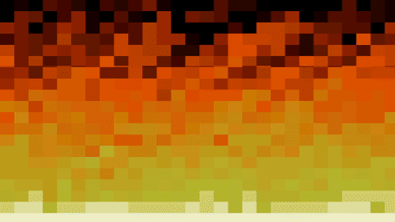

# 🔥 Doomfire GBA Demo

Este é um projeto de demonstração para **Game Boy Advance (GBA)** que implementa o clássico efeito **Doom Fire**.
O objetivo é reproduzir o efeito de fogo em tempo real respeitando as limitações de hardware do GBA, utilizando acesso direto à VRAM e manipulação eficiente de memória.

Inspirado na implementação apresentada por **Filipe Deschamps** no vídeo _"Tutorial completo de como programar o Fogo do DOOM (JavaScript puro)"_, que explica de forma didática o algoritmo e sua lógica de propagação.



---

## Funcionalidades

- Simulação em tempo real do efeito **Doom Fire**.
- Paleta de cores customizada para o GBA.
- Atualização eficiente da tela usando buffers e acesso direto à VRAM.
- Estrutura simples e didática para estudo de efeitos gráficos no GBA.

---

## Algoritmo Doom Fire

O efeito Doom Fire é baseado em uma **propagação vertical de intensidade de pixels**:

- A última linha da tela é constantemente alimentada com valores máximos de intensidade (fonte do fogo).
- Cada pixel acima calcula sua intensidade a partir de pixels abaixo, com uma pequena atenuação aleatória.
- O resultado cria a ilusão de chamas subindo e se dissipando.

### 🔢 Representação do Fogo

- Cada pixel é representado por um **índice de intensidade**.
- Esse índice é usado para acessar uma **paleta de cores**, indo de tons escuros até branco/amarelo intenso.
- O buffer de intensidades é atualizado a cada frame.

### 🔁 Passo básico do algoritmo

1. Inicializa a base do fogo com intensidade máxima.
2. Para cada pixel:

   - Lê um pixel abaixo
   - Subtrai um valor aleatório pequeno
   - Propaga o valor para cima com deslocamento horizontal opcional

Essa técnica é extremamente leve e ideal para hardware limitado como o GBA.

---

## Requisitos

- [Docker](https://www.docker.com/)
- [Docker Compose](https://docs.docker.com/compose/)

> 💡 O **devkitPro** já está incluído no ambiente Docker, não sendo necessário instalá-lo localmente.

---

## Como gerar o arquivo `.gba`

O build do projeto utiliza **devkitPro** dentro de um container Docker.

Execute na raiz do projeto:

```bash
docker compose -f docker-compose.yml up
```

### 📦 Saída do build

Após a execução, o arquivo gerado estará disponível em:

```text
./build/doomfire.gba
```

Esse arquivo pode ser executado em emuladores como:

- mGBA
- VisualBoyAdvance
- No$GBA

Ou em hardware real usando flashcarts compatíveis.

---

## Créditos

- **[devkitPro](https://devkitpro.org/)** – Toolchain para desenvolvimento GBA
- **[libtonc](https://www.coranac.com/tonc/text/toc.htm)** – Biblioteca e documentação para GBA
- 🎥 **Filipe Deschamps** – Pela inspiração e explicação.
  Vídeo: [Tutorial completo de como programar o Fogo do DOOM (JavaScript puro)](https://www.youtube.com/watch?v=fxm8cadCqbs)

---

Sinta-se livre para estudar, modificar e expandir este projeto.

Feito em C e nostalgia.
